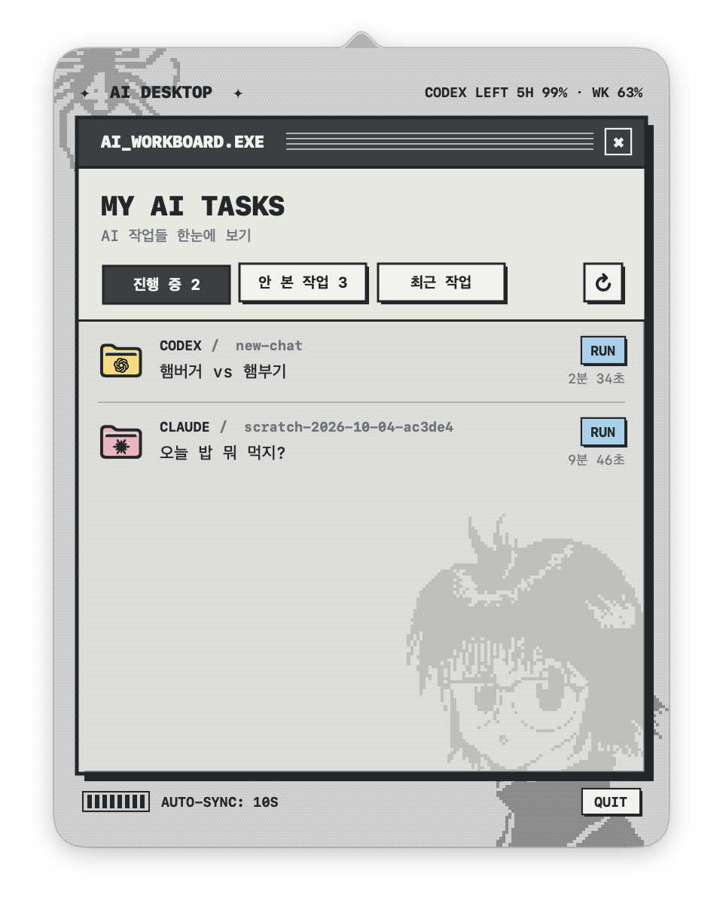

# AI Work Board

Mac 메뉴 막대에서 Codex, Claude, Antigravity 작업 상태를 모아 보여주는 로컬 앱입니다. 아이보리·민트색 창과 검은 윤곽선을 사용한 레트로 팝업으로 표시됩니다.

<p align="center"></p>

## 기능

- 메뉴 막대 아이콘을 누르면 Codex·Claude·Antigravity 작업 현황 팝업이 열립니다.
- 승인/확인이 필요한 작업이 있으면 아이콘이 통통 튑니다. Codex의 질문·권한 요청도 로컬 대화 기록에서 감지하며, 상태는 약 10초마다 갱신됩니다.
- 안 본 완료 작업이 있으면 아이콘에 주황색 점이 표시됩니다.

## 설치

1. [Releases](../../releases)에서 `AIWorkBoard-x.y.z.zip`을 받아 압축을 풉니다.
2. `AI Work Board.app`을 `응용 프로그램` 폴더로 옮깁니다.
3. **처음 한 번만:** 앱을 더블클릭하면 "Apple은 ... 확인할 수 없습니다" 경고가 뜹니다. 서명되지 않은 앱이라 나오는 안내이며, **"휴지통으로 이동"은 누르지 말고 "완료"를 누르세요.** 그다음 아래 중 하나로 여세요.
   - `시스템 설정 → 개인정보 보호 및 보안`을 열고, 아래쪽 "'AI Work Board'이(가) 차단되었습니다" 옆의 **그래도 열기**를 누릅니다. (macOS 15 이상에서는 우클릭 → 열기가 더 이상 통하지 않습니다.)
   - 터미널을 쓴다면 아래 한 줄로 해결됩니다.
     ```sh
     xattr -dr com.apple.quarantine "/Applications/AI Work Board.app"
     ```
4. 메뉴 막대에 로봇 아이콘이 나타납니다.

요구 사항: macOS 13 이상, Apple Silicon·Intel 모두 지원. Codex, Claude, Antigravity 중 쓰는 도구의 작업만 표시됩니다.

## 소스에서 빌드

Xcode Command Line Tools(`xcode-select --install`)가 필요합니다.

```sh
zsh build.sh                  # dist/AI Work Board.app (universal)
open "dist/AI Work Board.app"
zsh package.sh                # 배포용 zip 생성: dist/AIWorkBoard-<version>.zip
```

## 데이터

- Codex: `~/.codex/state_5.sqlite`와 `~/.codex/thread_history_1.sqlite`를 읽기 전용으로 조회합니다.
- Claude: `~/.claude/sessions/*.json`에서 실행 중인 세션을 조회합니다.
- Antigravity: `~/.gemini/antigravity/conversation_summaries.db`를 읽기 전용으로 조회합니다.
- 최근 작업은 최근 7일의 Codex·Antigravity 작업과 현재 열린 Claude 세션을 표시합니다.
- Codex 항목은 `codex://threads/<id>`로, Claude 항목은 `claude://code/continue?session=<hostSessionId>`로 해당 대화에 바로 이동합니다(세션 파일에 `hostSessionId`가 없으면 Claude 앱만 엽니다). Antigravity는 대화로 바로 가는 링크를 찾지 못해 해당 작업의 프로젝트 폴더를 Antigravity로 엽니다.

로컬 파일 형식이 변경되면 해당 공급자의 항목이 표시되지 않을 수 있습니다. 앱은 원본 데이터와 설정을 수정하지 않습니다.
